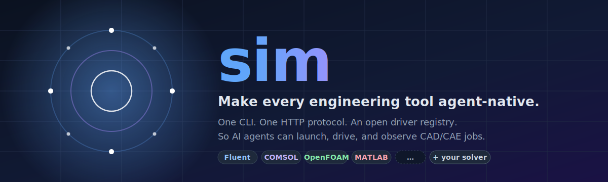
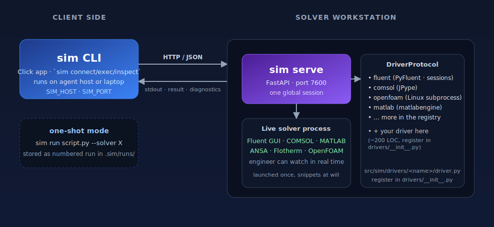

<div align="center">



<br>

**让每一款工程软件，都为 Agent 而生。**

*今天的 CAD/CAE 软件是为工程师点鼠标设计的。*
*明天的用户是 AI 智能体 —— 它需要一条进来的路。*

<p align="center">
  <a href="#-快速开始"></a>
  <a href="#-求解器注册表"></a>
  <a href="https://github.com/svd-ai-lab/sim-skills"></a>
  <a href="../LICENSE"></a>
</p>

<p align="center">
  
  
  
  
  
</p>

[English](../README.md) · [Deutsch](README.de.md) · [日本語](README.ja.md) · **中文**

[为什么是 sim](#-为什么是-sim) · [快速开始](#-快速开始) · [命令](#-命令) · [求解器](#-求解器注册表) · [Skills](https://github.com/svd-ai-lab/sim-skills)

</div>

---

## 🤔 为什么是 sim？

LLM 智能体早已知道怎么写仿真脚本 —— 训练数据里到处都是。它们真正缺的，是一个标准化的方式去**启动一个求解器、一步一步地驱动它、并在每一步之间观察结果**，再决定下一步怎么走。

今天的选项都很糟糕：

- **写完就跑的脚本** —— 智能体写 200 行，整体跑一遍，第 30 行的错误以乱码的形式出现在第 200 行，没有内省、没有恢复。
- **每个求解器一套自定义封装** —— 每个团队都在用不同的形状重复造同一个 launch / exec / inspect / teardown 循环。
- **闭源的厂商胶水** —— 无法组合、没有共同词汇、不会说 HTTP。

`sim` 就是缺失的那一层：

- **一套 CLI**，一套 HTTP 协议，一份**持续扩展的驱动注册表**，覆盖 CFD、多物理场、热分析、前处理、电池建模等等。
- **持久会话** —— 智能体在每一步之间都可以内省。
- **远程优先** —— CLI 客户端和真正的求解器可以位于不同的机器（局域网、Tailscale、HPC 头节点都行）。
- **配套 Agent skills** —— 教大模型如何安全地驱动每一个新后端。

> 容器运行时让 Kubernetes 与容器之间有了标准对话方式；**sim** 让 AI 智能体与工程软件之间也有了。

---

## 🏛 架构

<div align="center">
  
</div>

同一套 CLI 的两种执行模式，共享同一个 `DriverProtocol`：

| 模式 | 命令 | 适用场景 |
|---|---|---|
| **持久会话** | `sim serve` + `sim connect / exec / inspect` | 长时间、有状态、需要在每一步之间内省的工作流 |
| **一次性运行** | `sim run script.py --solver X` | 完整脚本作业，希望以编号形式存进 `.sim/runs/` |

完整的 driver 协议、服务器端点、执行管线见 [CLAUDE.md](../CLAUDE.md)。

---

## 🚀 快速开始

> **名字一览：** 仓库 `svd-ai-lab/sim-cli` · PyPI 分发名 `sim-cli-core` · 命令行 `sim` · 导入 `import sim`。是的，三个不同的字符串 —— 仓库名比第一次 PyPI 发布更早；其余的遵循 Python 打包惯例。

前置依赖：[`uv`](https://docs.astral.sh/uv/) —— 安装命令 `curl -LsSf https://astral.sh/uv/install.sh | sh`（macOS / Linux）或 `irm https://astral.sh/uv/install.ps1 | iex`（Windows PowerShell）。国内网络可设 `UV_DEFAULT_INDEX=https://pypi.tuna.tsinghua.edu.cn/simple`（PowerShell 是 `$env:UV_DEFAULT_INDEX = "..."`）走清华镜像。

**macOS / Linux：**

```bash
# 1. 在装有求解器的机器上，先装 sim 核心 ——
#    此时不用选 SDK：
uv pip install sim-cli-core

# 2. 让 sim 看一眼你的机器，自动选出合适的 SDK profile：
sim check <solver>
# → 报告本机检测到的 solver 安装，以及它们对应的 profile

# 3. 把那个 profile 的 env 启动起来（在 .sim/envs/<profile>/ 创建带固定
#    SDK 的隔离 venv；或者跳过这一步，第 5 步用 --auto-install 让它自动跑）：
sim env install <profile>

# 4. 启动 server（仅当需要跨机访问时才需要）：
sim serve --host 0.0.0.0          # FastAPI，默认端口 7600

# 5. 从智能体 / 你的笔记本 / 网络任意位置：
sim --host <server-ip> connect --solver <solver> --mode solver --ui-mode gui
sim --host <server-ip> inspect session.versions   # ← 总是先做这一步
sim --host <server-ip> exec "solver.settings.mesh.check()"
sim --host <server-ip> screenshot -o shot.png
sim --host <server-ip> disconnect
```

**Windows（PowerShell）：**

```powershell
# 1. 在装有求解器的机器上，先装 sim 核心：
uv pip install sim-cli-core

# 2. 让 sim 看一眼你的机器，自动选出合适的 SDK profile：
sim check <solver>

# 3. 启动 profile env（或第 4 步加 --auto-install 让它自动跑）：
sim env install <profile>

# 4. 启动 server（仅当需要跨机访问时才需要）：
sim serve --host 0.0.0.0          # FastAPI，默认端口 7600

# 5. 从智能体 / 你的笔记本 / 网络任意位置：
sim --host <server-ip> connect --solver <solver> --mode solver --ui-mode gui
sim --host <server-ip> inspect session.versions   # ← 总是先做这一步
sim --host <server-ip> exec "solver.settings.mesh.check()"
sim --host <server-ip> screenshot -o shot.png
sim --host <server-ip> disconnect
```

完整闭环：**检测 → 启动 env → 启动 → 驱动 → 观察 → 收尾** —— 工程师还可以同时盯着求解器 GUI 实时监控。

> **为什么要先 bootstrap？** 每个 `(solver, SDK, driver, skill)` 组合都是
> 独立的兼容性宇宙 —— 不同的 solver 版本可能需要不同的 SDK 版本，而这些
> SDK 版本未必能在同一个 Python env 中共存。sim 把每种组合当成一个隔离的
> "profile env"，于是同一台机器可以同时保留多个版本而不冲突。完整设计在
> [`docs/architecture/version-compat.md`](architecture/version-compat.md)。

---

## 📦 插件索引

`sim plugin install <name>` 按顺序查两个索引：

1. **svd 维护的 wheel manifest**：`https://cdn.svdailab.com/manifest.json` —— 项目自己发布的预构建 wheel。匿名 GET，每次有新 wheel 就更新。
2. **社区维护的 catalogue**：[`sim-plugin-index`](https://github.com/svd-ai-lab/sim-plugin-index) —— 更广的插件清单，由社区维护；条目可以是 OSS 也可以是第三方插件，指向 GitHub release 或 git+https。

第一个命中的赢。多数用户感知不到这个分层 —— `sim plugin install ltspice` 直接就能装上。

svd manifest 的 schema（社区 catalogue 是另一种 shape，看它仓库里的说明）：

```json
{
  "updated": "<ISO date>",
  "plugins": {
    "<name>": {
      "version": "<X.Y.Z>",
      "wheel": "https://cdn.svdailab.com/wheels/<file>.whl"
    }
  }
}
```

如果想跳过 resolver 直接装某个 wheel，把 URL 直接给 `sim plugin install`：`sim plugin install https://cdn.svdailab.com/wheels/<file>.whl`。

---

## ✨ 特性

### 🧠 为 Agent 而生
- **持久会话**跨代码片段保持，求解器永不在任务中途重启
- **逐步内省** —— 每次操作之间都可以 `sim inspect`
- **预检 `sim lint`** —— 在启动前抓出缺失的导入和不支持的 API
- **编号运行历史**存于 `.sim/runs/`，通过 `sim logs` 浏览

### 🔌 求解器无关
- **一套协议** (`DriverProtocol`) —— 每个 driver 仅 ~200 行，注册到 `drivers/__init__.py` 即可
- **持久 + 一次性**两种模式共用同一个 CLI
- **开放注册表** —— 新求解器持续加入；CFD、多物理场、热、前处理、电池模型都在范围内
- **配套 skills** 在 [`sim-skills`](https://github.com/svd-ai-lab/sim-skills) —— 让大模型立刻知道每个新后端的坑

### 🌐 远程友好
- **HTTP/JSON 传输** —— 凡是能跑 `httpx` 的地方都能跑
- **客户端 / 服务端分离** —— 智能体在笔记本上、求解器在 HPC 节点、GUI 在工作站
- **Tailscale-ready** —— 为跨网络 mesh 部署而设计

---

## ⚙️ 命令

| 命令 | 功能 | 类比 |
|---|---|---|
| `sim check <solver>` | 检测安装版本并解析 profile | `docker info` |
| `sim env install <profile>` | 启动 profile env（venv + 固定 SDK） | `pyenv install` |
| `sim env list [--catalogue]` | 列出已启动的 env（或全部目录） | `pyenv versions` |
| `sim env remove <profile>` | 销毁一个 profile env | `pyenv uninstall` |
| `sim serve` | 启动 HTTP 服务器（跨机使用时需要） | `ollama serve` |
| `sim connect` | 启动求解器，建立会话 | `docker start` |
| `sim exec` | 在活跃会话中执行 Python 片段 | `docker exec` |
| `sim inspect` | 查询实时会话状态（含 `session.versions`） | `docker inspect` |
| `sim ps` | 显示当前活跃会话与其 profile | `docker ps` |
| `sim screenshot` | 抓取求解器 GUI 截图 | — |
| `sim disconnect` | 关闭会话 | `docker stop` |
| `sim run` | 一次性脚本执行 | `docker run` |
| `sim lint` | 执行前的静态检查 | `ruff check` |
| `sim logs` | 浏览运行历史 | `docker logs` |

所有涉及主机的命令（`check`、`env`、`connect`、`exec`、`inspect`、`disconnect`）都接受 `--host <ip>`，会改为对远程 `sim serve` 执行而不是本机。

环境变量：客户端用 `SIM_HOST`、`SIM_PORT`；运行存储与 profile env 都放在 `SIM_DIR`（默认 `.sim/`）。

### 怎么选 profile

通常不用自己选。`sim check <solver>` 会告诉你已装的 solver 对应哪个 profile，`sim connect ... --auto-install` 会在第一次使用时帮你 bootstrap。逃生口：

- **指定 profile：** `sim connect --solver <solver> --profile <profile>`
- **完全跳过 profile env（旧路径 / 测试）：** `sim connect --solver <solver> --inline`
- **进阶：单 env 直接装：** 把对应的 plugin 包直接装到当前 venv（例如 `pip install <plugin-package>`），跳过 `sim env`。同一台机器只需要一个 solver 版本时合适。

完整设计：[`docs/architecture/version-compat.md`](architecture/version-compat.md)。

---

## 🆚 为什么不直接跑脚本？

| 写完就跑的脚本 | sim |
|---|---|
| 写完整个脚本，运行，祈祷收敛 | 连接 → 执行 → 观察 → 决定下一步 |
| 第 2 步的错误到第 12 步才暴露 | 每一步都先验证再发下一步 |
| 智能体看不见求解器状态 | 每次操作之间都能 `sim inspect` |
| 每次迭代都重启求解器 | 一个持久会话，随心发片段 |
| GUI 对人不可见 | 工程师监控 GUI，智能体后台驱动 |
| 输出解析每个项目都重写 | `driver.parse_output()` 直接给结构化字段 |

---

## 🧪 求解器注册表

`sim-cli` 核心**完全求解器无关** —— 出厂**零内置 driver**。所有求解器（包括 OpenFOAM）都通过**插件包**接入，由 `sim.drivers` entry-point group 注册。新增一个后端 = 一份 ~200 LOC 的 `DriverProtocol` 实现，独立成 `sim-plugin-<name>` 仓库。

`sim` 最适合驱动 **GUI-heavy 求解器** —— COMSOL、ANSYS Mechanical、ANSYS Fluent、MATLAB Simulink、Abaqus、Flotherm —— 这些工具如果不用持久会话，agent 每迭代一次都得重新点一遍对话框。

参考插件实现见 [`sim-plugin-ltspice`](https://github.com/svd-ai-lab/sim-plugin-ltspice)。

每个求解器的协议、片段、演示工作流都住在 [`sim-skills`](https://github.com/svd-ai-lab/sim-skills)，它**同样在持续扩展** —— 每加一个新后端就配一份 agent skill。

---

## 🛠 开发

参见 [`docs/DEVELOPMENT.md`](DEVELOPMENT.md)：环境搭建、项目结构、新增 driver、开发标志、分层 skill 系统。

---

## 🔗 关联项目

- **[`sim-skills`](https://github.com/svd-ai-lab/sim-skills)** —— 每个支持后端的 agent skills、片段、演示工作流

---

## 📄 许可证

Apache-2.0 —— 见 [LICENSE](../LICENSE)。
